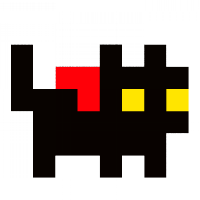

**NO LONGER MAINTAINED**

# Geocats 

### Prerequisites
 - [Godot Engine](https://godotengine.org/)
 - Catnip (optional)

### Download the project
With [Git](https://git-scm.com/):

```
git clone https://git.disroot.org/Nonaco/Geocats.git
```

or as an [archive](https://git.disroot.org/Nonaco/Geocats/Nonaco/Geocats/archive/main.zip)


### Open the project.godot file with the Godot Engine import function

### Have fun!

### Collaborate
We are always looking for ways to collaborate. If you are interested email us [here](mailto:geocats@protonmail.com)

### Project Chat Rooms
 - [Telegram](https://t.me/GeocatsOfficial)
 - [Discord](https://discord.gg/3vAHNTwYJe)

## License
The entire source code is licensed under [GPLv3](LICENSE), but our assets including all images and sound files are licensed under [CC BY-NC-SA 4.0](LICENSE.by-nc-sa-4.0.md)

